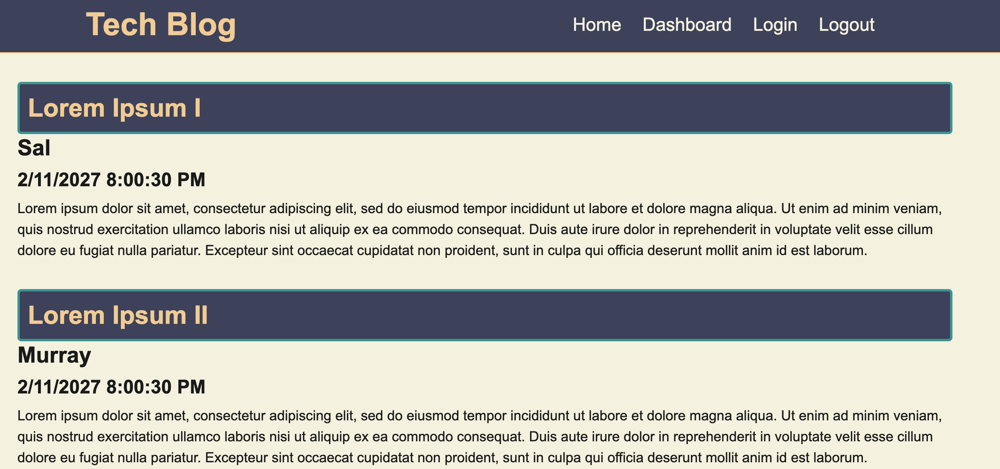

# Tech Blog Using MVC and Handlebars
  ##  
   
  ## Licensing:
  
  ## Table of Contents: 
  - [Description](#description)
  - [Technology](#technology)
  - [Installation](#installation)
  - [Usage](#usage)
  - [Questions](#questions)

  ## Description:
  This is a deployed blog application with user accounts and comments enabled.   
  ## Technology:
  Express, Node.js, Handlebars, bcrypt, Heroku, MySQL 
  ## Installation: 
  This is a deployed web app, so no special directions are required.  
  ## Usage: 
  Users are able to sign up or log in to the app.  There they can read, post, and update blog posts.  Users are also able to leave comments on blog posts.  They can also delete blog posts and comments if logged in.  User data from login session is protected.  
  ## License: 
  None Provided 
  ## Questions: 
  lmc@uga.edu◊
  
  <https://github.com/tripledawg>